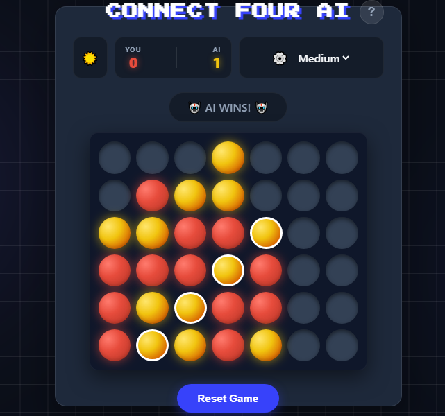

# 🔴🟡 Connect Four AI (Cyberpunk Edition)


> A modern, retro-styled Connect Four game featuring a Minimax-powered AI opponent. Built with a decoupled architecture (Python Backend + Vanilla JS Frontend).

---

## 📸 Screenshots


---

## 🎮 Features

### For Players
* **Smart AI:** Play against an AI powered by the Minimax algorithm with Alpha-Beta pruning.
* **Adaptive Difficulty:** Choose between Easy, Medium, and Hard modes (depth-adjusted).
* **Retro UI:** A fully responsive "Glassmorphism" design with neon glows and 8-bit typography.
* **3D Elements:** CSS-only 3D disc styling with realistic lighting.
* **Dark/Light Mode:** Toggle between Cyberpunk Night and Clean Day themes.

### For Developers
* **Decoupled Architecture:** Frontend and Backend are completely separate, allowing independent deployment (e.g., Vercel + Render).
* **REST API:** The frontend communicates with the AI via a clean JSON API.
* **Responsive Grid:** Fluid CSS Grid layout that adapts to any screen size without breaking.

---

## 🛠️ Tech Stack

### Frontend
* **HTML5 & CSS3:** Custom variables, Flexbox/Grid, and CSS animations.
* **JavaScript (ES6+):** Async/Await for API calls, DOM manipulation.
* **Assets:** "Press Start 2P" font (Google Fonts).

### Backend
* **Python 3.10+:** Core logic.
* **FastAPI:** High-performance web framework for the AI API.
* **Uvicorn:** ASGI server.
* **NumPy:** Efficient board array manipulation.

---

## 🚀 Getting Started (Local Development)

Follow these instructions to set up the project on your local machine for development and testing.

### Prerequisites
* Python 3.x installed.
* Git installed.
* A code editor (VS Code recommended).

### 1. Clone the Repository
```bash
git clone [https://github.com/harry-kami/connect-four-ai.git](https://github.com/your-username/connect-four-ai.git)
cd connect-four-ai

### 2. Backend Setup (The Brain)
Navigate to the backend folder and set up a virtual environment to isolate dependencies.

```bash
cd backend

# 1. Create a virtual environment
python -m venv venv

# 2. Activate the environment
# Windows:
venv\Scripts\activate
# Mac/Linux:
# source venv/bin/activate

# 3. Install dependencies
pip install -r requirements.txt

# 4. Start the server
uvicorn main:app --reload